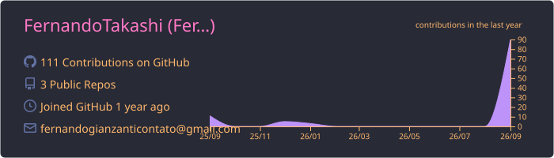
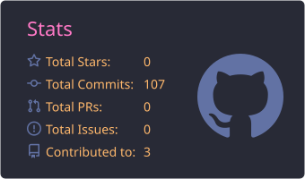
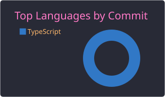

<h1 align="center">Hi, I'm Fernando Gianzanti 👋</h1>

  <b>ABAP Developer @ SAP</b> · Computer Engineering student at FSA · Founder of a tech consultancy

  
  
  
  <!-- When the consultancy website is live, uncomment and fill in the link:
  
  -->

---
🧑‍💻 About me
💼 Working as an ABAP developer in the SAP ecosystem
🎓 Studying Computer Engineering at Centro Universitário Fundação Santo André (FSA)
🚀 Running a tech consultancy that builds websites, systems and games
🌱 Currently building Emprestai, my capstone project (TCC): a sharing economy app for lending items between people
💬 Ask me about SAP/ABAP, web development and turning ideas into products
---
🛠️ Tech stack
Enterprise

Web

Other

---
📌 Featured projects
Project	Description
Emprestai	Capstone project (TCC): a web/mobile app for lending items between users, focused on sustainability and social inclusion
Expense manager	A personal finance app with monthly budget closing
Consultancy portfolio	The website for my tech consultancy
<!-- Tip: turn each project name into a link once its repository is public, e.g. [**Emprestai**](https://github.com/fernandotakashi/emprestai) -->
---
📊 GitHub stats
<!-- These images are generated by the GitHub Action in .github/workflows/profile-cards.yml

  

  
  

---
🐍 Contributions
<!-- Generated by .github/workflows/snake.yml into the "output" branch -->
<picture>
  <source media="(prefers-color-scheme: dark)" srcset="https://raw.githubusercontent.com/fernandotakashi/fernandotakashi/output/github-snake-dark.svg">
  <source media="(prefers-color-scheme: light)" srcset="https://raw.githubusercontent.com/fernandotakashi/fernandotakashi/output/github-snake.svg">
  
</picture>
